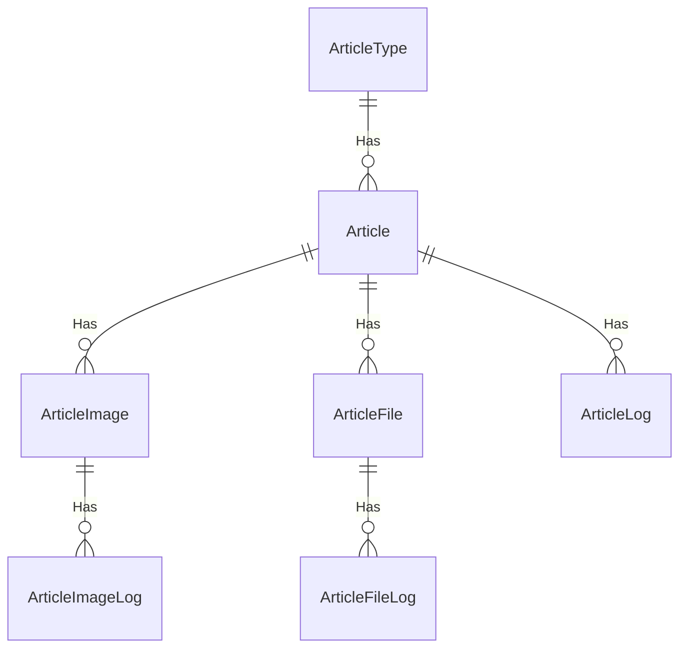

# 和泰移動-文章管理-系統設計-功能頁面 API 匯總
[TOC]
## 資料表規格

### ArticleType / 文章分類主檔
| table name: ArticleType |  |  |  |  |  |  |  |
|-------------------------|--|--|--|--|--|--|--|
| Column Name | FullName | Data Type | PK | IX | 非NULL | Description | Default Value |
| ArticleTypeId |  | int | ● |  | ● | 分類id | IDENTITY |
| ArticleTypeName |  | nvarchar(50) |  |  | ● | 分類名稱 |  |
| CreateTime |  | DateTime |  |  | ● | 建立時間 | GetDate() |
| CreateUser |  | uniqueidentifier |  |  | ● | 建立使用者 |  |
| UpdateTime |  | DateTime |  |  | ● | 更新時間 |  |
| UpdateUser |  | uniqueidentifier |  |  | ● | 更新使用者 |  |

### Article / 文章主檔
| table name: Article |  |  |  |  |  |  |  |
|---------------------|--|--|--|--|--|--|--|
| Column Name | FullName | Data Type | PK | IX | 非NULL | Description | Default Value |
| ArticleId |  | uniqueidentifier | ● |  | ● | 文章guid | Guidgenerate() |
| ArticleTypeId |  | int |  | ● |  | 分類id |  |
| Title |  | nvarchar(50) |  |  | ● | 文章標題 |  |
| Content |  | text |  |  | ● | 文章內容 |  |
| ReadCount |  | int |  |  | ● | 文章閱讀次數 | 0 |
| IsEnable |  | tinyInt |  |  | ● | 未結束/已結束 | 1 |
| CreateTime |  | DateTime |  |  | ● | 建立時間 | GetDate() |
| CreateUser |  | uniqueidentifier |  |  | ● | 建立使用者 |  |
| UpdateTime |  | DateTime |  |  | ● | 更新時間 | GetDate() |
| UpdateUser |  | uniqueidentifier |  |  | ● | 更新使用者 |  |

### ArticleImage / 文章圖片主檔
| table name: ArticleImage |  |  |  |  |  |  |  |
|--------------------------|--|--|--|--|--|--|--|
| Column Name | FullName | Data Type | PK | IX | 非NULL | Description | Default Value |
| ArticleId |  | uniqueidentifier | ● |  | ● | 文章guid | Guidgenerate() |
| ImageSeq |  | int | ● |  | ● |  | IDENTITY |
| FileName |  | nvarchar(100) |  |  |  |  |  |
| FileUri |  | nvarchar(500) |  |  |  |  |  |
| CreateUser |  | uniqueidentifier |  |  |  |  |  |
| CreateTime |  | DateTime |  |  |  |  |  |

### ArticleFile / 文章檔案主檔
| table name: ArticleFile |  |  |  |  |  |  |  |
|-------------------------|--|--|--|--|--|--|--|
| Column Name | FullName | Data Type | PK | IX | 非NULL | Description | Default Value |
| FileSeq |  | int | ● |  | ● | 檔案流水號 | IDENTITY |
| ArticleId |  | uniqueidentifier |  | ● | ● | 文章guid |  |
| FileName |  | nvarchar(100) |  |  | ● | 檔案名稱 |  |
| AzureFileName |  | nvarchar(500) |  |  | ● | Azure Blob Storage Name | 名稱格式：{containerName}&{功能代號}-{TimeStamp} |
| CreateTime |  | DateTime |  |  | ● | 建立時間 | GetDate() |
| CreateUser |  | uniqueidentifier |  |  | ● | 建立使用者 |  |
| UpdateTime |  | DateTime |  |  | ● | 更新時間 | GetDate() |
| UpdateUser |  | uniqueidentifier |  |  | ● | 更新使用者 |  |

### ArticleLog / 文章日誌主檔
| table name: ArticleTypeLog |  |  |  |  |  |  |  |
|----------------------------|--|--|--|--|--|--|--|
| Column Name | FullName | Data Type | PK | IX | 非NULL | Description | Default Value |
| ArticleTypeId |  | int | ● |  | ● | 分類id |  |
| LogSeq |  | int | ● |  | ● | Log流水號 | IDENTITY |
| ArticleTypeName |  | nvarchar(50) |  |  | ● | 分類名稱 |  |
| CreateTime |  | DateTime |  |  | ● | 建立時間 | GetDate() |
| CreateUser |  | uniqueidentifier |  |  | ● | 建立使用者 |  |

### ArticleLog / 文章日誌主檔
| table name: ArticleLog |  |  |  |  |  |  |  |
|------------------------|--|--|--|--|--|--|--|
| Column Name | FullName | Data Type | PK | IX | 非NULL | Description | Default Value |
| ArticleId |  | uniqueidentifier | ● |  | ● | 文章guid |  |
| LogSeq |  | int | ● |  | ● | Log流水號 | IDENTITY |
| ArticleTypeId |  | int |  | ● |  | 分類id |  |
| Operation |  | int |  |  | ● | "操作id 1-更新 2-刪除" |  |
| Title |  | nvarchar(100) |  |  |  | 文章標題 |  |
| Content |  | text |  |  |  | 文章內容 |  |
| Reason |  | nvarchar(1000) |  |  | ● | 異動原因 |  |
| IsEnable |  | tinyInt |  |  | ● | 未結束/已結束 | 0 |
| CreateTime |  | DateTime |  |  | ● | 建立時間 | GetDate() |
| CreateUser |  | uniqueidentifier |  |  | ● | 建立使用者 |  |

### ArticleImageLog / 文章圖片日誌主檔
| table name: ArticleImageLog |  |  |  |  |  |  |  |
|-----------------------------|--|--|--|--|--|--|--|
| Column Name | FullName | Data Type | PK | IX | 非NULL | Description | Default Value |
| ArticleId |  | uniqueidentifier | ● |  | ● | 文章guid |  |
| ImageSeq |  | int | ● |  | ● |  |  |
| LogSeq |  | int | ● |  | ● | Log流水號 | IDENTITY |
| FileName |  | nvarchar(100) |  |  |  |  |  |
| FileUri |  | nvarchar(500) |  |  |  |  |  |
| CreateUser |  | uniqueidentifier |  |  |  |  |  |
| CreateTime |  | DateTime |  |  |  |  |  |

### ArticleFileLog / 文章檔案日誌主檔
| table name: ArticleFileLog |  |  |  |  |  |  |  |
|----------------------------|--|--|--|--|--|--|--|
| Column Name | FullName | Data Type | PK | IX | 非NULL | Description | Default Value |
| ArticleId |  | uniqueidentifier | ● | ● | ● | 文章guid |  |
| LogSeq |  | int | ● |  | ● | Log流水號 |  |
| FileSeq |  | int | ● |  | ● | 檔案流水號 |  |
| FileName |  | nvarchar(100) |  |  | ● | 檔案名稱 |  |
| AzureFileName |  | nvarchar(500) |  |  | ● | Azure Blob Storage Name | 名稱格式：{containerName}&{功能代號}-{TimeStamp} |
| CreateTime |  | DateTime |  |  | ● | 建立時間 | GetDate() |
| CreateUser |  | uniqueidentifier |  |  | ● | 建立使用者 |  |

## 資料表關連

## 資料表關連描述

1. ArticleType ||--o{ Article : Has
關係類型：一對多（1:N）
解釋：一個文章類型（ArticleType）可以有零個或多個（o{）文章（Article）。

2. Article ||--o{ ArticleImage : Has
關係類型：一對多（1:N）
解釋：一個文章（Article）可以有零個或多個（o{）文章圖片（ArticleImage）。

3. Article ||--o{ ArticleFile : Has
關係類型：一對多（1:N）
解釋：一個文章（Article）可以有零個或多個（o{）文章檔案（ArticleFile）。

4. Article ||--o{ ArticleLog : Has
關係類型：一對多（1:N）
解釋：一個文章（Article）可以有零個或多個（o{）文章日誌（ArticleLog）。

5. ArticleImage ||--o{ ArticleImageLog : Has
關係類型：一對多（1:N）
解釋：一個文章圖片（ArticleImage）可以有零個或多個（o{）文章圖片日誌（ArticleImageLog）。

6. ArticleFile ||--o{ ArticleFileLog : Has
關係類型：一對多（1:N）
解釋：一個文章檔案（ArticleFile）可以有零個或多個（o{）文章檔案日誌（ArticleFileLog）。

# 文章分類管理-查詢頁面
